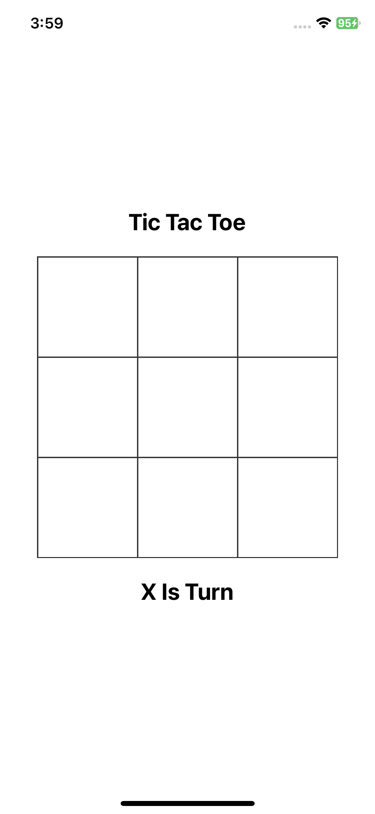

# Tic Tac Toe

A simple implementation of the Tic Tac Toe game in React Native.

## Features

- Play Tic Tac Toe against another player.
- Reset the game board at any time.
- Display the winner or a draw result.
- Highlight the winning squares.

## Installation

1. Clone the repository: `git clone https://github.com/pirtpal-matharu/TicTacToe.git`

2. Navigate to the project directory: `cd tic-tac-toe`

3. Install the dependencies: `yarn install`

3. Install the pods: `cd ios/ && pod install`

4. Start the development server: `npx react-native run-ios --device`

5. Run the app on a connected device.

## Usage

1. Launch the app on your device or emulator.

2. The game board will be displayed with a 3x3 grid.

3. Tap on any empty square to place your move.

4. The game will alternate between players until a winner is determined or the game ends in a draw.

5. To reset the game, press the "Reset" button.

## Screenshots

## Video

## Technologies Used

- React Native

## License

This project is licensed under the MIT License. See the [LICENSE](LICENSE) file for details.
